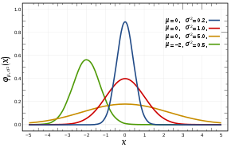
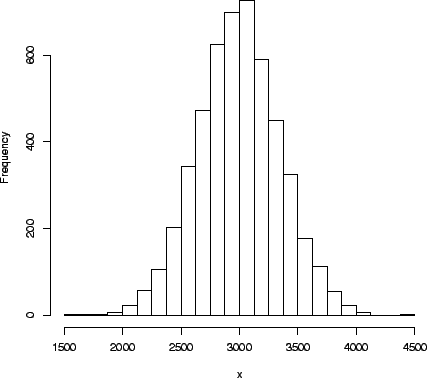
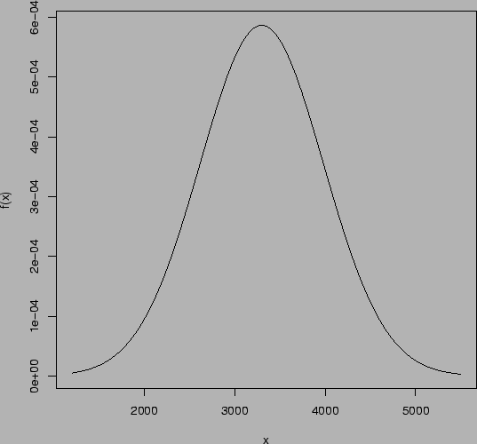
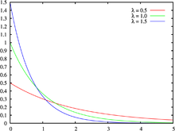
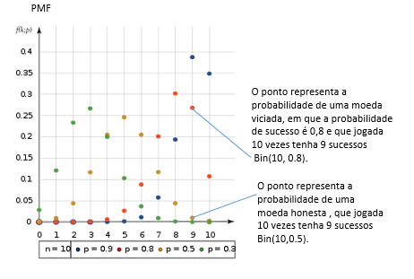

```{r setup, include=FALSE}
knitr::opts_chunk$set(echo = FALSE)
```

## Objetivos

 O presente relatório tem como objetivo descrever os seguintes tópicos a respeito da distribuição de probabilidade e sua aplicação no R.
 
- Definição;
- Variáveis aleatórias discretas;
- Variáveis aleatórias contínuas;
- Tipos de distribuições de probabilidade;
- Distribuições de probabilidade no R;
- Aplicações.

## Definição

Uma distribuição de probabilidade é um modelo matemático que relaciona um certo valor da variável em estudo com a sua probabilidade de ocorrência.

- Exemplos práticos:

  - Qual a probabilidade de se jogar uma moeda duas vezes para o alto e cair Coroa nas duas vezes;
  - Qual o valor da corrente elétrica passada no fio durante uma hora.

# Variáveis aleatórias 

- Discretas
- Contínuas

## Discretas

- Os valores estão contidos no conjunto dos números Naturais;
- Exemplos práticos:
  - Número de jogos  ganhos;
  - Número de defeitos em peças de uma fábrica;
  - Número de caras em três lançamentos de moeda.

## Contínuas

- Os valores estão contidos no conjunto dos números Reais;
- Exemplos práticos:
  - Alturas de um grupo;
  - Pesos de fruta;
  - Corrente elétrica em um cabo elétrico.
  
# Tipos de distribuições de probabilidade

- Normal
- Exponencial
- Binomial
- Poisson

## Normal:
 É uma curva simétrica em torno do seu ponto médio, na qual é similar ao formato de um sino.
 
 ``` {r fig1, out.width="70%", fig.align='center', fig.cap = "Representação gráfica de algumas funções de distribuição de probabilidade normal"}
knitr :: 
```

## Normal:

### Exemplo

O peso de recém-nascidos é uma variável aleatória contínua. A Figura abaixo mostram a distribuição de frequências relativas de 100 e 5000 pesos de recém-nascidos com intervalos de classe de 125g.

 ``` {r fig2, out.width="35%", fig.align='center', fig.cap = "Histograma de frequências relativas a 5000 pesos de reçem-nascidos com intervalo de classe de 125g"}
knitr :: 
```

## Normal:

### Exemplo

 ``` {r fig3, out.width="40%", fig.align='center', fig.cap = "Função de densidade de probabilidade para a variável aleatória contínua X=peso do recém-nascido (g)"}
knitr :: 
```

## Exponencial:
 É uma distribuição contínua onde a função densidade de probabilidade segue uma função exponencial, que depende de um parâmetro `λ`, e é definida apenas para `X` não negativos.
 
 ``` {r fig4, out.width="60%", fig.align='center', fig.cap = "Representação gráfica de algumas funções de distribuição de probabilidade exponencial"}
knitr :: 
```

## Binomial:
 É um cálculo estatístico utilizado para identificar a probabilidade de ocorrência de determinado evento dentro de um sistema fechado e utilizando de uma sequência limitada de tentativas.
 
 ``` {r fig7, out.width="60%", fig.align='center', fig.cap = "Representação gráfica de algumas funções de distribuição de probabilidade binomial"}
knitr :: 
```

## Poisson:

 É uma distribuição de probabilidade de variável aleatória discreta que expressa a probabilidade de uma série de eventos ocorrer num certo período de tempo se estes eventos ocorrem independentemente de quando ocorreu o último evento.
 
 ``` {r fig10, out.width="60%", fig.align='center', fig.cap = "Representação gráfica de algumas funções de distribuição de probabilidade Poisson"}
knitr :: include_graphics( "distr.poisson.png" )
```

## Distribuições de probabilidade no R

### Abreviaturas dos nomes da distribuições:

 As distribuições mais comuns são:
 
- `norm` <- normal;
- `exp` <- exponencial;
- `binom` <- binomial; e
- `pois` <- Poisson.

## Distribuições de probabilidade no R

### Operações funcionais:

 Para utilização da função, se coloca a letra de indicação junto com a abreviação do tipo de distribuição já citada.
 
- `d` calcula a densidade de probabilidade f(x)no ponto x;
- `p` calcula a função de probabilidade acumulada F(x)no ponto x;
- `q` calcula o quantil correspondente a uma dada probabilidade;
- `r` retira uma amostra aleatória da distribuição.

## Aplicações

<div text: "justify">

 Para profissionais da engenharia civil ela proporciona previsões úteis sobre a demanda e distribuição de eventos na área de planejamento e controle de produção.
 A estatística e probabilidade possui relevância nos segmentos de prevenção de catástrofes e impactos ambientais, resistência dos materiais, controle de qualidade e um melhor aperfeiçoamento nos projetos onde o Engenheiro tem que dominar com exatidão a ampla grade de ferramentas para se destacar no mercado.

</div>
