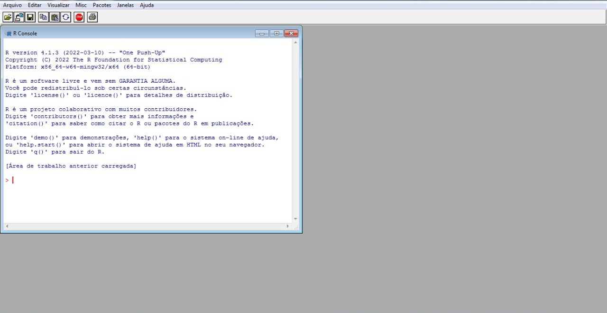
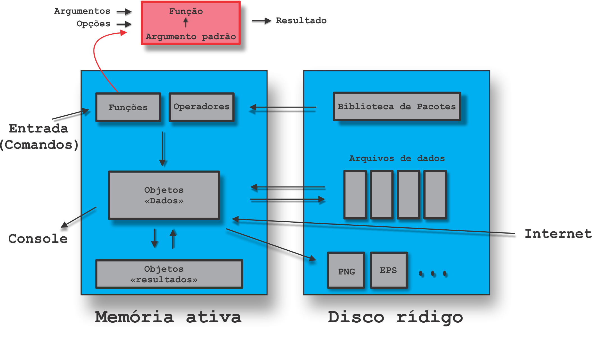
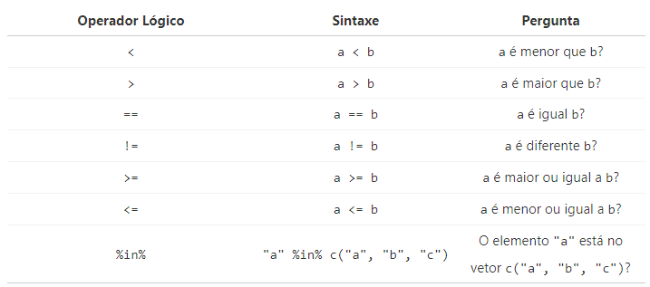
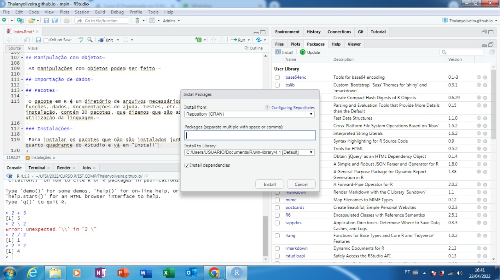

```{r setup, include=FALSE}
knitr::opts_chunk$set(echo = TRUE)
```
--- 

# Objetivo

Descrever as ideias básicas sobre o ambiente R:

- Como instalar o R e o RStudio;
- Diferenças entre o R e a IDE RStudio;
- Como o R trabalha;
- Comandos elementares;
- Objetos;
- Manipulação com objetos;
- Importação de dados;
- Pacotes:
  - Instalação;
  - Como usar.
 
# Apresentação do relatório

 Diante do objetivo do relátorio, apresentaremos nas próximas subseções, os pontos a serem discutidos.

## Como instalar o R e o RStudio

- Para a instalação do R em Windows [clique aqui](https://cran.r-project.org/bin/windows/base/) e siga as instruções do site.

- Para instalação do RStudio [clique aqui](https://www.rstudio.com/products/rstudio/download/#download).

- Observações:
  - O site informa sobre a necessidade de ser Windows 10/11 para instalação do RStudio, porém pode funcionar normalmente em versões anteriores.
  - Para a ultilização do RStudio, é necessário a instalação do R.
  
## Diferenças entre o R e a IDE RStudio

- O R é uma linguagem e ambiente para análise estatística e produção de gráficos, que possui uma interface que as janelas se sobrepõem de acordo com os comandos feitos. Já o RStudio é uma interface para o R, ou seja, é um facilitador visual para a utilização do R, no qual possui quadro quadrantes individuais.

- Interface do R:

{width="75%"}

- Interface do RStudio:

{width="75%"}

## Como o R trabalha

A imagem a seguir apresenta esquematicamente como o R trabalha:




 Assim,
 
 - Tudo que existe em R é um objeto;
 - Tudo que acontece no R é uma chamada de função.

## Comandos elementares
 Os comandos são funções pré definidas que podem ser inseridas no Console (primeiro quadrante do RStudio) e que retornam resultados.
 Eles podem ser divididos entre expressões e atribuições.

- Expressões:
 
 São comandos para resolver expressões, utilizando os sinais de "+", "-", "/" e de "*", para retornar os resultados de soma, subtração, divisão e multiplicação, respectivamente.
 
  Exemplo:
 
```Gitbub
 # Para fazer uma soma de dois elementos
 
 4 + 6
 
 # O R retorna
 
 [1] 10
```

- Atribuições:

 As atribuições servem para vincular um objeto a outro, utilizando a simbologia "<-". 
 
 Exemplo:
 
```Gitbub
 #Para criar um vínculo entre uma letra e um número, insere o seguinte comando
 
 x <- 4
 
 #Sempre que digitar "x" no console, ele irá retornar o número "4".
```
 
## Objetos

 Tudo no R é chamado de objeto, que possui características internas contendo informações necessárias para interpretar sua estrutura e conteúdo.
 
 Os objetos podem ser dividios entre vetores, fatores, matrizes, data.frame, tibbles e listas.

## Manipulação com objetos

 Comandos para manipulação:
 
- Criação de um vetor:
 
 ```Github
 nome_vetor <- c()
 ```
 
- Tipo de vetor:
 
 Retorna qual é o tipo de vetor, como por exemplo: "double" ou "character".

 ```Github
 typeof(nome_vetor)
 ```
 
- Operações:
 
 As operações apresentadas nas expressões do tópico anterior, também podem ser utilizadas com vetores, sendo realizadas com cada elemento do vetor. Exemplo:
 
 ```Github
 c1(1, 2, 3) + c2(4, 5, 6)
 
 [1] 5 7 9
 ```
- Operadores lógicos:
 
 Dão um retorno de "sim ou não", no modo operacional, retorna TRUE/FALSE, de acordo com a pergunta feita. A tabela abaixo apresenta a sintaxe e a pergunta correspondente.
 
 

## Importação de dados

 A importação de dados serve para facilitar a utilização de dados vindos de outros locais, como por exemplo do Excel, aonde é mais simples e comum de se gerar um conjunto de informações. Assim, é possível trabalhar os dados e funcionalidades da plataforma e trazê-la para o RStudio em um formato legível.
 
- 1º Passo:
 
 Vá em: "Environment", no quarto quadrante -> "Import Dataset", escolha a opção de acordo com o formato do arquivo a ser importado.
 
- 2º Passo:

 Na janela que será aberta, procure e selecione o arquivo de dentro do seu computador. Em seguida aparecerá uma janela de configuração.
 
- 3º Passo:

 Para que o RStudio compreenda corretamente o arquivo, ainda na janela e configuração, é necessário certificar que em "Separator" esteja como "semicolon", ou seja, elementos separados por ponto e vírgula. Já em "Decimal" precisa estar com "comma".
 
 Assim, o arquivo será salvo em "Environment" como um novo objeto, indicando quantas variáveis e quantas linhas de dados.

## Pacotes

 O pacote em R é um diretório de arquivos necessários para carregar um código de funções, dados, documentações de ajuda, testes, etc. O próprio R em sua instalação, contém 30 pacotes, que dizemos que são as funções mínimas para a utilização da linguagem.

### Instalações

 Para instalar os pacotes que não são instalados junto do R, vá em "packages" no quarto quadrante do RStudio e vá em "Install".
 Em seguida, será aberto a tela apresentada na imagem abaixo.
 
 

 Nesta janela é possível pesquisar os pacotes para serem instalados. Os principais indicados são: rmarkdown, knitr, postcards e tinytex.
 
### Como usar

 Uma vez instalado o pacote, precisamos carregar e anexá-lo, para que possamos utilizar os recursos disponíveis no pacote, como funções, dados, etc. Isso significa, disponibilizar na memória e inseri-lo no caminho de busca, respectivamente. 
 
```Github
#Para fazer essas duas ações ao mesmo tempo use a função

library()

#ou

require()
```

 A primeira função se for utilizada sem argumento algum, retorna todos os pacotes instalados na bibioteca de pacotes do R.
 
 ---
 
  Para mais detalhes sobre os pontos discutidos, acesse [Programação em R (Nível Básico)](https://bendeivide.github.io/cursor/nbasico.html).