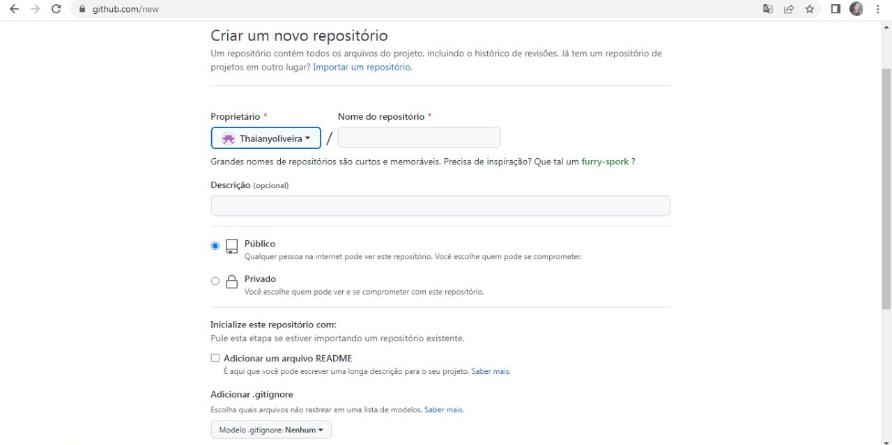
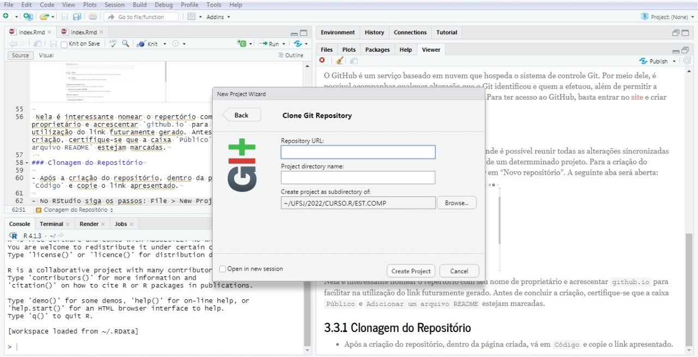
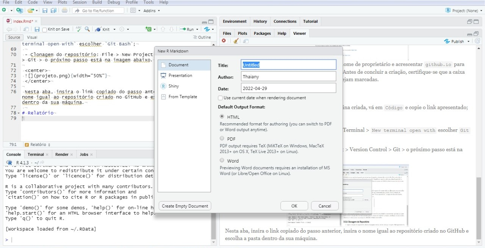

```{r setup, include=FALSE}
knitr::opts_chunk$set(echo = TRUE)
```
--- 

# Objetivo

 Descrever passo a passo como construir o relatório no RStudio para o Github.

# Apresentação do relatório

 Para a contrução do relário, é necessário seguir os tópicos abaixo.
 
# Pré definições

 A seguir será apresentado quais passos devem ser seguidos antes do desenvolvimento do relatório.

## Git
 O Git é um programa que identifica as mudanças realizadas em determinados arquivos e sincroniza tais alterações no modo online.
 Para realizar a instalação na máquina clique [aqui](https://git-scm.com/downloads).
 
## GitHub
 O GitHub é um serviço baseado em nuvem que hospeda o sistema de controle Git. Por meio dele, é possível acompanhar qualquer alteração que o Git identificou e quem a efetuou, além de permitir a restauração do código removido ou modificado.
 Para ter acesso ao GitHub, basta entrar no [site](https://github.com/) e criar uma conta seguindo os passos indicados.
 
## Repositório
 O repositório é uma "pasta" dentro do GitHub onde é possível reunir todas as alterações sincronizadas pelo Git, permitindo um melhor gerenciamento de um determminado projeto.
 Para a criação do repositório, basta abrir sua conta no GitHub e ir em "Novo repositório".
 A seguinte aba será aberta:
 
 <center>
 {width="70%"}
 </center>

 Nela é interessante nomear o repertório com seu nome de proprietário e acrescentar `github.io` para facilitar na utilização do link futuramente gerado. Antes de concluir a criação, certifique-se que a caixa `Público` e `Adicionar um arquivo README` estejam marcadas.
 
### Clonagem do Repositório

- Após a criação do repositório, dentro da página criada, vá em `Código` e copie o link apresentado;

- No RStudio:

  - Ativação do Git: 
  
  > Tools > Global Options... > Terminal > `New terminal open with` escolher `Git Bash`
 
  - Clonagem do repositório: 
  
  > File > New Project > Version Control > Git > o próximo passo está na imagem abaixo

 <center>
 {width="70%"}
 </center>

 Nesta aba, insira o link copiado do passo anterior, insira o nome igual ao repositório criado no GitHub e escolha a pasta dentro da sua máquina.
 
# Relatório

 O relatório criado em RStudio nada mais é que a escrita em um programa que será traduzido para outras linguagens, de acordo com sua escolha. 
 
## Criação do Relatório

Para sua criação é necessário seguir os passos abaixo:
 
 > File > New File > R Markdown... > `New R Markdown`
 
 <center>
 {width="70%"}
 </center>
 
 Nesta nova janela, nomeie o arquivo de `index` para conseguir abri-lô como página diretamente pelo GitHub.
 Em `Default Output Format` permite escolher os formatos de saída do texto, podendo gerar um `HTML`, `PDF` ou `Word`.
 
## Envio para o GitHub

 Após escrever o relatório, é necessário clicar em `Knit`, na opção `to HTML`. Este passo irá mostrar como ficará a página da web.
 Para enviar para o GitHub existem duas maneiras:
 
 - Via Git: no quarto quadrante, vá em:
 
 > `Git` > `Commit` > seleciona tudo > faz o comentário > `commit` > `Push`.
 
 - Via Terminal:
 
```{Github}
$ git add .
$ git commit -m "comentário"
$ git push

```

## Acesso ao relatório online

 Dentro do GitHub, após ter enviado o relatório seguindo um dos passos anteriores, no repositório clonado, vá em:
 
 > `Settings` > `Pages` > Publique a página.
 
 Esses passos irá gerar o link de uma página, na qual é o relatório desenvolvido.
 
# Funcionalidades

 O relatório pode ser utilizado para criar uma página na internet contendo por exemplo: estudos, explicações e currículos.

## Estrutura de Escritas

Assim, como outros programas textuais, há maneiras de se diferenciar letras, títulos e pontuações. No R Markdown funciona da seguinte maneira:

- Escrita em:
  - Itálico: `(_Itálico_)` _Itálico_;
  - Negrito: `(**negrito**)` **negrito**;
 
- Vínculos:
  - Link: `[nome_do_link](link)`[link](https://thaianyoliveira.github.io/)
  - Imagens: ``
  
- Pontuações:
  - Título: `#`
  - Sub título: `##`
  - Seção: `-`
  - Sub seção: `"tab" -`

 ---
 
  Para mais detalhes sobre os pontos discutidos, acesse [Programação em R (Nível Básico)](https://bendeivide.github.io/slides/estcomp/s06/).
